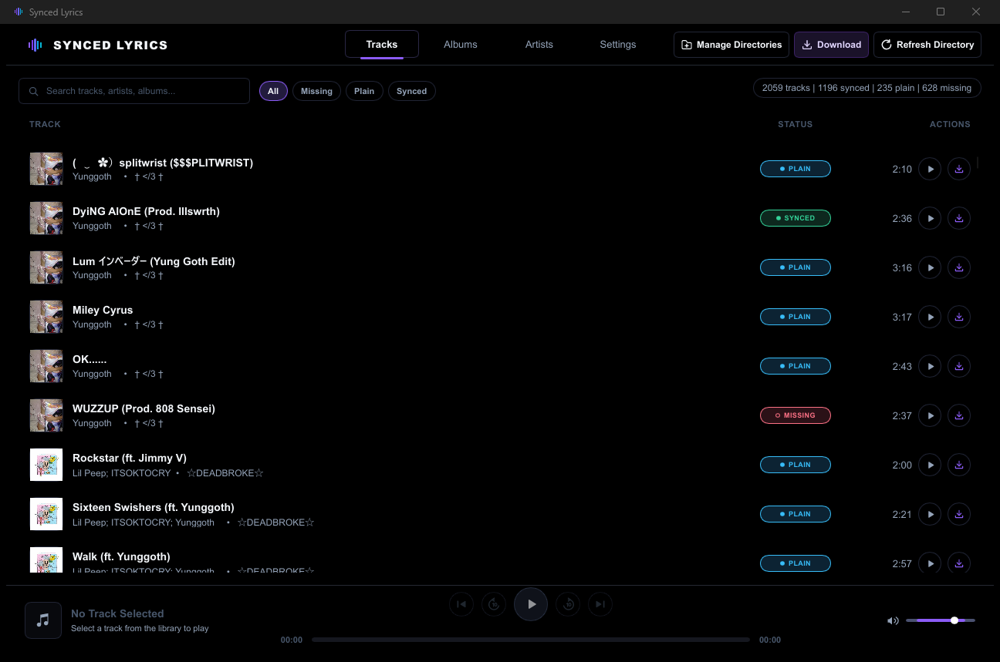
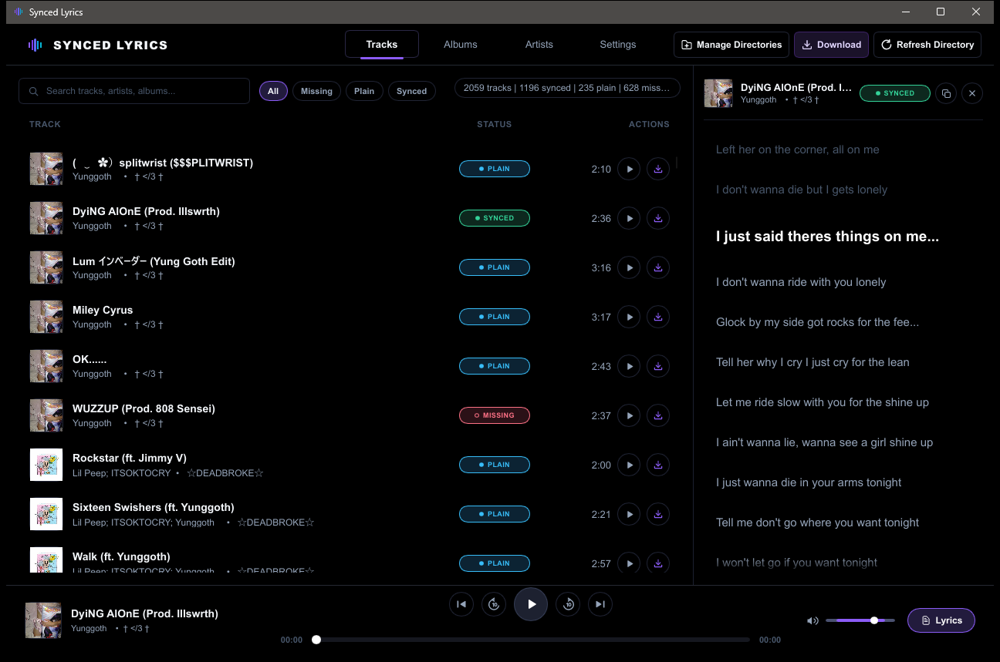
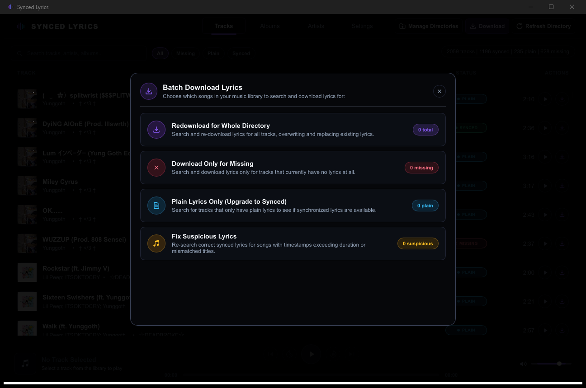
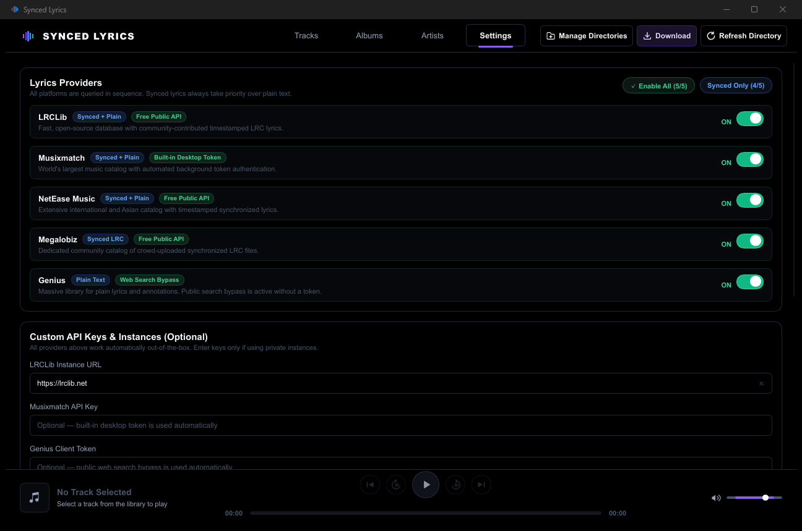
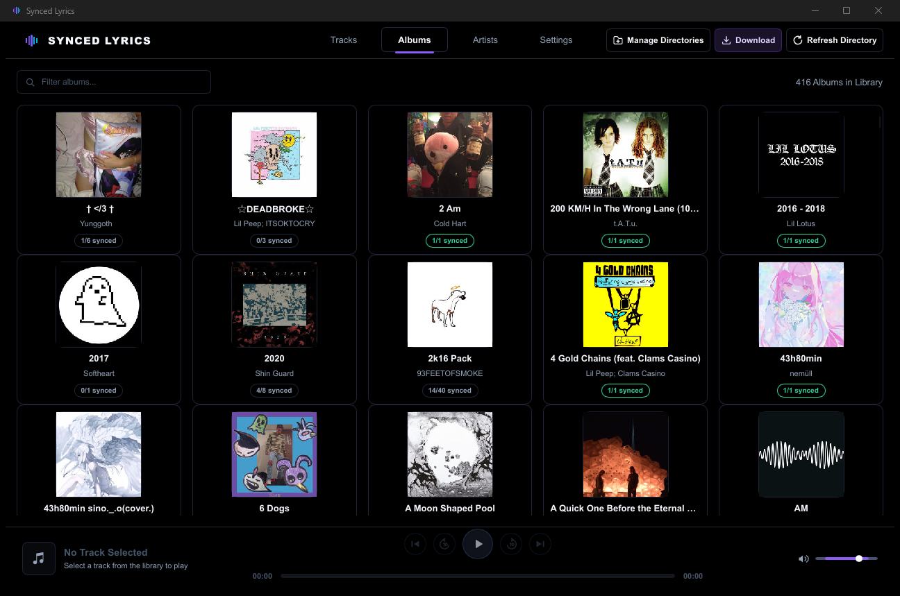
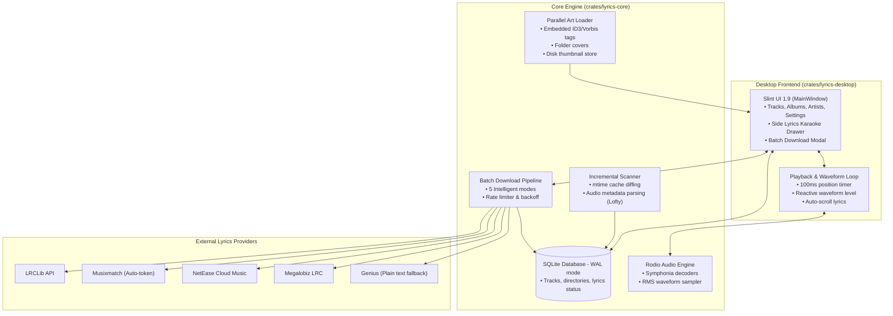

# 🎵 Synced Lyrics GUI

<div align="center">


### Fast, Minimalist, Pure-Black Native Desktop Lyrics Manager & Karaoke Player

[](https://github.com/Sandeep2062/Synced-Lyrics-GUI/releases)
[](LICENSE)
[](https://www.rust-lang.org/)
[](https://slint.dev/)
[](#-installers--pre-built-binaries)
[](https://github.com/Sandeep2062/Synced-Lyrics-GUI/actions)

*A blazing-fast, lightweight native desktop application built with **Rust** and **Slint** featuring a modern pure-black UI for discovering, downloading, editing, and playing time-synchronized (`.lrc`) and plain-text lyrics for your local music collection.*

[**Features**](#features) • [**App Showcase**](#app-showcase) • [**How It Works**](#how-it-works) • [**Getting Started**](#getting-started) • [**Git & Contribution Guide**](#git-workflow) • [**Releases**](#releases)

</div>

---

<a id="app-showcase"></a>
## 📸 App Showcase

<div align="center">
  
  <p><em>Pure-black high-contrast dark theme, live library metrics, instant search & status filters, cover art thumbnails, and integrated audio playback.</em></p>
</div>

<br/>

### Interface Highlights

| Synchronized Karaoke Drawer | Live Batch Download Dashboard |
| :---: | :---: |
|  |  |
| *Real-time auto-scrolling synced lyrics, active line highlighting, click-to-seek, and live audio waveform visualizer.* | *Real-time download stats, provider status pills, live activity logs, and pause/resume controls.* |

| Multi-Provider Settings | Album & Artist Views |
| :---: | :---: |
|  |  |
| *Toggle providers (LRCLib, Musixmatch, NetEase, Megalobiz, Genius), configure custom instances and API keys.* | *Browse your collection by albums and artists with automatic cover extraction and sync completion badges.* |

---

<a id="features"></a>
## ✨ Features

- 🖤 **Pure-Black Modern UI**: Native desktop GUI built using [Slint](https://slint.dev/) with a clean, high-contrast dark theme inspired by LRCGET. Fluid 60fps performance, zero webview, zero electron bloat, and minimal memory footprint (<50MB RAM idle).
- 🎤 **Karaoke Player & Lyrics Viewer**:
  - Built-in native audio engine powered by [Rodio](https://github.com/RustAudio/rodio) and [Symphonia](https://github.com/pdeljanov/Symphonia).
  - Smooth auto-scrolling lyrics with active line highlighting and click-to-seek playback.
  - Interactive audio waveform scrubber with live audio amplitude reactive bars.
  - Volume control with mute toggle and 10-second skip/rewind controls.
- 🔄 **5 Intelligent Download Modes**:
  - **Missing Only**: Searches lyrics exclusively for tracks lacking an `.lrc` file.
  - **Smart Update**: Downloads missing lyrics, upgrades plain text to time-synced lyrics, and audits suspicious tracks.
  - **Upgrade Plain → Synced**: Detects plain `.lrc` files without timestamps and searches for synchronized versions.
  - **Fix Suspicious**: Audits your library for mismatched lyrics (timestamps exceeding audio duration, ending too early, or mismatched titles) and cross-checks all providers for the best version.
  - **Replace All**: Force re-downloads and updates lyrics for all tracks.
- ⚡ **Multi-Platform Search & Native Lyrics Aggregation**:
  - Queries **LRCLib**, **Musixmatch**, **NetEase**, **Megalobiz**, and **Genius** in priority order.
  - Native Musixmatch token rotation for 100% full synced lyrics out-of-the-box without requiring an API key.
  - Configurable self-hosted LRCLib instance URL support.
  - Adaptive per-provider rate limiting, exponential backoff, and circuit breaking on HTTP 429.
- 📊 **Live Download Dashboard & Progress**:
  - Real-time provider status pills (🔍 Searching, ✅ Synced found, 📝 Plain found, ❌ Not found, ⏸ Rate limited).
  - Activity log with full download details, ETA timer, and one-click log export.
  - Pause, resume, and cancel batch operations at any time.
- 🗄️ **Persistent Library & Instant Incremental Scanning**:
  - Embedded SQLite database (`WAL` mode) tracking directories, tracks, lyrics status, and query history.
  - Fast incremental `mtime` diffing: skips unchanged files during directory rescans for near-instant library updates.
  - Parallel background artwork extraction: reads embedded tags (`ID3`, `Vorbis`, `MP4`) and folder covers (`cover.jpg`, `folder.jpg`, etc.).
  - Disk-backed 192px thumbnail cache for instantaneous cover loading on launch.
- 🌐 **Cross-Platform & Portable**:
  - Native standalone installers and portable packages for Windows, macOS, and Linux.

---

<a id="providers"></a>
## 🔑 API Keys & Provider Details

| Provider | Lyrics Type | Authentication | Default Speed | Notes |
| :--- | :--- | :--- | :--- | :--- |
| **LRCLib** | Synced & Plain | None (Public) | ~60 req/min | Primary provider; high quality community database. Supports custom self-hosted instance URLs. |
| **Musixmatch** | Synced & Plain | Built-in or API Key | ~30 req/min | Built-in desktop token rotation provides full synced lyrics out-of-the-box. Optional API key support. |
| **NetEase** | Synced & Plain | None | ~40 req/min | Excellent international and Asian music catalog coverage. |
| **Megalobiz** | Synced | None | ~30 req/min | Community LRC database for popular tracks. |
| **Genius** | Plain only | Built-in or Client Token | ~10 req/min | Final fallback for plain text lyrics when no synced lyrics exist. |

---

<a id="how-it-works"></a>
## 🧠 How It Works (Architecture & Internals)

Synced Lyrics GUI is structured as a modular Cargo workspace consisting of two primary crates:

```
Synced-Lyrics-GUI/
├── crates/
│   ├── lyrics-core/       # Headless core engine (logic, DB, scanner, audio, providers)
│   └── lyrics-desktop/    # Native Slint UI application & audio player loop
├── assets/                # Application icons and preview screenshots
├── packaging/             # Packaging scripts (Inno Setup, DMG, AppImage, Debian)
└── docs/                  # Architecture specs and plans
```

### Architecture Diagram



### 1. Incremental Library Scanning
When scanning a music directory, Synced Lyrics GUI reads file modified timestamps (`mtime`) and compares them against its SQLite store. Unchanged audio files are skipped immediately without touching metadata tags or decoding audio headers, scanning thousands of songs in under a second.

### 2. Lyrics Synchronization & Matching
- Files are parsed for both embedded lyrics and adjacent `.lrc` files (`<song>.lrc`).
- Synced timestamps (`[mm:ss.xx]`) are parsed into centisecond integer offsets.
- During audio playback, the audio engine synchronizes with the active line using binary search interpolation, keeping the active lyric line centered in the drawer with smooth scrolling.

### 3. Provider Fallback Pipeline
When searching lyrics for a song:
1. Provider queries are dispatched sequentially in order of preference (`LRCLib` → `Musixmatch` → `NetEase` → `Megalobiz` → `Genius`).
2. Synced lyrics always take priority over plain text.
3. If a provider hits a rate limit (HTTP 429), an adaptive exponential backoff is triggered automatically without crashing or stalling the queue.

---

<a id="getting-started"></a>
## 🚀 Getting Started

### Prerequisites

You will need the **Rust** toolchain (Cargo & rustc) installed on your system.

1. **Install Rust**:
   - **Windows**: Download and run [rustup-init.exe](https://rustup.rs/).
   - **macOS / Linux**:
     ```bash
     curl --proto '=https' --tlsv1.2 -sSf https://sh.rustup.rs | sh
     ```
   - Restart your terminal and verify:
     ```bash
     cargo --version
     rustc --version
     ```

2. **Install Platform Build Dependencies**:
   - **Windows**:
     - Visual Studio Build Tools with the **Desktop development with C++** workload.
   - **Ubuntu / Debian**:
     ```bash
     sudo apt update
     sudo apt install -y build-essential pkg-config libasound2-dev libfontconfig1-dev libxkbcommon-dev
     ```
   - **Fedora / RHEL**:
     ```bash
     sudo dnf install -y alsa-lib-devel fontconfig-devel libxkbcommon-devel
     ```
   - **Arch Linux**:
     ```bash
     sudo pacman -S --needed base-devel alsa-lib fontconfig libxkbcommon
     ```
   - **macOS**:
     ```bash
     xcode-select --install
     ```

---

### 📥 Cloning the Repository

Choose either HTTPS or SSH to clone the repository to your local machine:

#### Via HTTPS:
```bash
git clone https://github.com/Sandeep2062/Synced-Lyrics-GUI.git
cd Synced-Lyrics-GUI
```

#### Via SSH:
```bash
git clone git@github.com:Sandeep2062/Synced-Lyrics-GUI.git
cd Synced-Lyrics-GUI
```

Verify that the workspace compiles cleanly:
```bash
cargo check --workspace
```

---

### ▶️ Running the Application

#### 1. Run in Development Mode
To launch the desktop application directly with cargo:
```bash
cargo run -p lyrics-desktop
```

#### 2. Run with Debug Logging
To view detailed network requests, provider lookups, and audio engine traces in your terminal:
```bash
# On Linux/macOS
RUST_LOG=info cargo run -p lyrics-desktop

# On Windows (PowerShell)
$env:RUST_LOG="info"; cargo run -p lyrics-desktop
```

#### 3. Run with Software Renderer (Optional)
If your graphics driver has OpenGL or hardware composition issues:
```bash
# On Windows (PowerShell)
$env:SLINT_BACKEND="software"; cargo run -p lyrics-desktop

# On Linux/macOS
SLINT_BACKEND=software cargo run -p lyrics-desktop
```

---

### 🧪 Running Tests & UI Snapshot Audits

The project includes an extensive test suite covering unit tests, metadata parsing, LRC formatting, provider responses, and headless UI snapshot audits:

```bash
# Run all workspace unit tests
cargo test --workspace

# Run headless UI snapshot regression test
cargo test -p lyrics-desktop ui_snapshot -- --nocapture
```

The UI snapshot harness uses Slint's software renderer to capture pixel-perfect PNG snapshots into `target/ui-snapshots/` and verifies that no unthemed widgets or misaligned elements appear.

---

### 📦 Building for Production / Release

To build an optimized, standalone release executable:

```bash
cargo build --release -p lyrics-desktop
```

The optimized binary will be created at:
- **Windows**: `target/release/lyrics-desktop.exe`
- **Linux**: `target/release/lyrics-desktop`
- **macOS**: `target/release/lyrics-desktop`

You can run this standalone executable directly or copy it anywhere on your system.

---

<a id="git-workflow"></a>
## 🤝 Git & Commit Workflow Guide

We welcome contributions! Whether fixing a bug, adding lyrics providers, or enhancing the Slint UI, follow this guide to keep git history clean and consistent.

### 1. Create a Topic Branch
Never work directly on `main`. Always create a descriptive branch:

```bash
# Ensure you are on latest main
git checkout main
git pull origin main

# Create and switch to your feature or fix branch
git checkout -b feat/add-new-provider
# or
git checkout -b fix/audio-seek-glitch
```

### 2. Make Your Code Changes
- Keep changes focused on a single topic.
- Preserve existing comments and docstrings.
- Ensure the code conforms to Rust standards.

### 3. Verify Code Quality & Tests Before Staging
Before committing, run all formatters, linters, and tests:

```bash
# Check code formatting
cargo fmt --check

# Run clippy for linting
cargo clippy --workspace --all-targets

# Run the test suite
cargo test --workspace
```

### 4. Stage and Review Your Changes
Check exactly what files you modified:

```bash
# Check status of changed files
git status

# Inspect the exact diff
git diff

# Stage specific files
git add crates/lyrics-core/src/providers/new_provider.rs
git add README.md
```

### 5. Writing a Great Commit Message (Conventional Commits)

We follow the [Conventional Commits](https://www.conventionalcommits.org/) specification. Each commit should follow the format:

```
<type>(<scope>): <short summary>

[optional longer body explaining why the change was made]
```

#### Commit Types:
| Type | Description | Example |
| :--- | :--- | :--- |
| `feat` | A new user-facing feature | `feat(player): add repeat track toggle` |
| `fix` | A bug fix | `fix(lrc): correct timestamp parsing for 3-digit centiseconds` |
| `docs` | Documentation changes | `docs(readme): add detailed guide for clone and commit` |
| `style` | Code style changes (whitespace, formatting) | `style: run cargo fmt on lyrics-desktop` |
| `refactor` | Code refactoring without changing behavior | `refactor(db): streamline batch upsert transaction` |
| `perf` | Performance improvement | `perf(art): cache downsampled 192px covers to disk` |
| `test` | Adding or updating tests | `test(scanner): add test for corrupted ID3 tags` |
| `ci` | CI/CD workflow changes | `ci: add libfontconfig dependency to Linux workflow` |
| `chore` | Maintenance tasks, dependency updates | `chore(deps): update slint to 1.9` |

#### Example Commit Command:
```bash
git commit -m "feat(ui): add keyboard shortcut to toggle lyrics drawer"
```

### 6. Push Your Branch & Open a Pull Request
Push your branch to your GitHub fork or repository:

```bash
git push -u origin feat/add-new-provider
```

Then navigate to [GitHub Pull Requests](https://github.com/Sandeep2062/Synced-Lyrics-GUI/pulls) and click **New Pull Request**. Include:
- A clear description of the problem solved.
- Screenshots or recordings if UI changes were made.
- Confirmation that `cargo test --workspace` passes.

---

<a id="releases"></a>
## 🏷️ Installers & Pre-Built Binaries

Pushing a version tag (`git tag v1.0.0 && git push origin v1.0.0`) triggers automated multi-platform GitHub Actions workflows that publish release assets for Windows, macOS, and Linux:

| Platform | Installer | Portable Package | Description |
| :--- | :--- | :--- | :--- |
| **Windows** | `Synced-Lyrics-windows-x86_64-setup.exe` | `Synced-Lyrics-windows-x86_64-portable.zip` | Inno Setup modern dark wizard, desktop shortcut, console suppressed. |
| **macOS** | `Synced-Lyrics-macos.dmg` | `Synced-Lyrics-macos-portable.tar.gz` | Drag-and-drop DMG installer with high-DPI icon bundle. |
| **Linux** | `Synced-Lyrics-linux-amd64.deb` & `Synced-Lyrics-linux-x86_64.AppImage` | `Synced-Lyrics-linux-x86_64-portable.tar.gz` | Debian package with desktop entry, universal AppImage, and standalone tarball. |

### 🔒 User Data Retention & Portable Mode
- **Automatic Upgrade Retention**: Upgrading via installer or replacing binaries retains all settings, music directory paths, credentials, and SQLite track indices.
- **Legacy Python Migration**: Upgrading from older Python builds (`SyncedLyricsGUI`) automatically imports your configured music directories, settings, and library database on first launch.
- **Portable Mode**: In portable builds, creating a `data/` folder (or keeping `portable.dat`) directs the app to store all settings and the database locally next to the executable, ideal for USB drives.

---

<a id="supported-formats"></a>
## 🎵 Supported Audio Formats

Synced Lyrics GUI supports reading metadata and embedded lyrics from all common audio formats via [Lofty](https://github.com/Serial-ATA/lofty-rs) and native playback via [Rodio](https://github.com/RustAudio/rodio) / [Symphonia](https://github.com/pdeljanov/Symphonia):

| Format | Extensions | Embedded Tags | Audio Playback |
| :--- | :--- | :---: | :---: |
| **MP3** | `.mp3` | ID3v1, ID3v2.3, ID3v2.4 | ✅ |
| **FLAC** | `.flac` | Vorbis Comments | ✅ |
| **M4A / AAC** | `.m4a`, `.aac`, `.mp4` | MP4 iTunes tags | ✅ |
| **OGG Vorbis** | `.ogg`, `.oga` | Vorbis Comments | ✅ |
| **Opus** | `.opus` | Vorbis Comments | ✅ |
| **WAV** | `.wav` | RIFF INFO / ID3 | ✅ |
| **ALAC** | `.m4a` | Apple Lossless | ✅ |

> [!TIP]
> For optimal lyrics matching accuracy, make sure your audio files have accurate **Title** and **Artist** tags. If tags are missing, Synced Lyrics GUI intelligently falls back to clean filename heuristics (e.g. `Artist - Title.mp3`).

---

## 📄 License

This project is licensed under the **MIT License**. See the [LICENSE](LICENSE) file for details.

---

<div align="center">
  <b>Built with ❤️ using <a href="https://www.rust-lang.org/">Rust</a> and <a href="https://slint.dev/">Slint</a></b>
</div>
